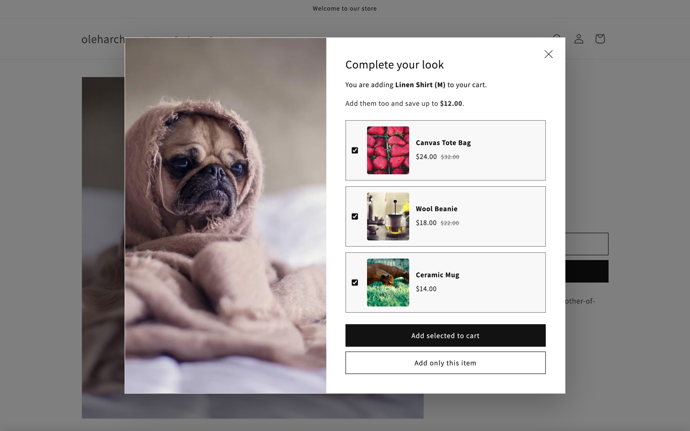
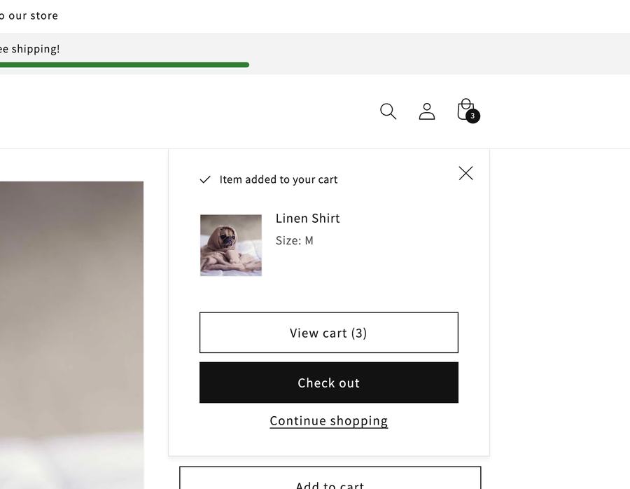
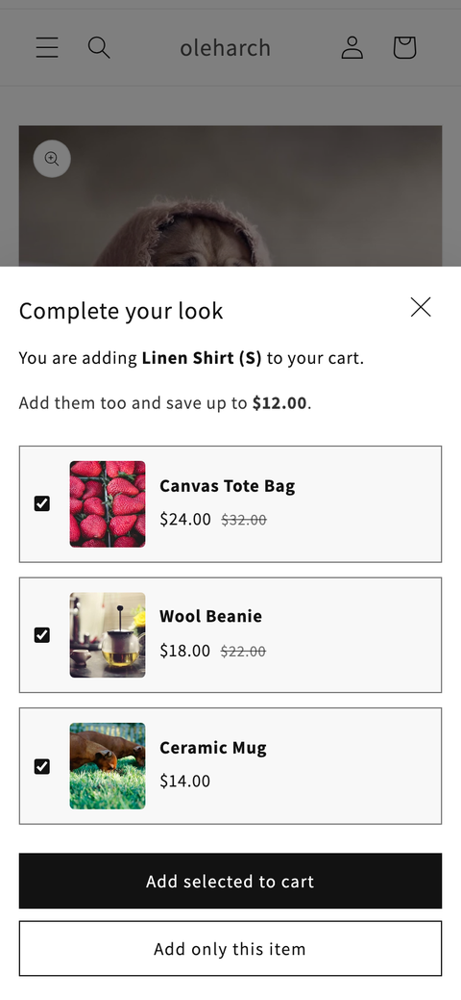

# Complete the look for Shopify Dawn

A product page section that steps in when a customer clicks **Add to cart** and offers products that go
with it. One click adds the product and the chosen extras together; the other adds only the product,
through the theme's own cart flow.

Built for Dawn 15 and 16 on the documented Shopify APIs. No app, no jQuery, no Shadow DOM.
Passes [Theme Check](https://shopify.dev/docs/storefronts/themes/tools/theme-check) with zero offenses.



## The brief

> On the product page, when the customer clicks Add to cart, show a modal before anything is added:
> the product they are adding, a few recommended products with prices and the saving, and two buttons.
> "Add to cart" adds the product and the recommendations, "Continue" adds only the product.
> The merchant picks the products, the heading, and whether the modal shows once per customer.

What this version adds on top of the brief: per-product picks from a metafield, a checkbox per pick,
variant selects for picks with options, and a fallback that never blocks the purchase.

## How it works

1. **Intercept.** A `submit` listener on `document` in the capture phase catches the main product form
   before Dawn's own handler. It also catches Enter in the quantity field, not only button clicks, and
   keeps working when Dawn replaces the whole product block (combined listings swap the product in place).
2. **Render for the selected variant.** The section re-renders itself through the
   [Section Rendering API](https://shopify.dev/docs/api/ajax/section-rendering)
   (`?variant=<id>&section_id=<id>`). Images, prices, compare-at prices, the saving and every text come from
   Liquid, formatted with the shop's money format and locale.
3. **Show.** A native `<dialog>` opened with `showModal()`: top layer, focus, Escape, inert page and
   light dismiss (`closedby="any"`) come from the browser.
4. **Add selected.** One `POST` to [`/cart/add.js`](https://shopify.dev/docs/api/ajax/reference/cart#post-locale-cart-add-js)
   with `items`: the product with the quantity, selling plan and line item properties from the theme's form,
   plus every checked pick. The request asks for the `sections` of the theme's cart drawer or cart
   notification and passes the response to its `renderContents()`, exactly like Dawn's product form does.
   The cart opens, the cart count updates, and Dawn's `cart-update` event fires for other sections.
5. **Add only this item.** The original submit is let through with `form.requestSubmit()`, so the theme adds
   the product as if the modal never existed.

If anything is off (no picks, a network error, a file upload in the form) the submit goes through untouched.



## Files

```
sections/complete-the-look.liquid   markup, schema, picks, saving: everything rendered in Liquid
assets/complete-the-look.js         <complete-the-look> custom element: intercept, render, add
assets/complete-the-look.css        styles on Dawn's colour scheme variables, loaded by the section
```

## Install

1. Copy the three files into your theme.
2. Theme editor, product template: **Add section**, then **Complete the look**. Place it below the product information.
3. Choose the products to offer, one of two ways:
   - **Per product (recommended).** In the admin go to *Settings*, *Custom data*, *Products*, *Add definition*.
     Use namespace and key `custom.complete_the_look` and type *Product*, *List of products*. Then fill it on each product.
   - **One list for every product.** Pick the products in the section settings. With the metafield source
     it is also the fallback for products without the metafield.

The product itself and sold-out products are skipped automatically.

## Settings

| Setting | |
|---|---|
| Open on Add to cart | Turn the modal on or off without removing the section |
| Products to offer | Metafield then list, or list only |
| Products, Products to show | The list (up to 8) and how many to show (1 to 4) |
| Open once per session | Uses `sessionStorage` |
| Show product image, Show SKU | Layout options |
| Color scheme | Any Dawn colour scheme; buttons and typography follow it |
| Texts | Heading, text with `[product]`, savings text with `[amount]`, button labels, close label |

## Why it is built this way

| Decision | Instead of | Why |
|---|---|---|
| Render in Liquid, refresh through the Section Rendering API | `fetch('/products/<handle>.js')` and building HTML in JS | Money format, currency, Markets, translations and image sizes stay correct. One request instead of one per product |
| Listen to `submit` in the capture phase | `click` on the submit button | Covers Enter in inputs, survives a replaced product block, and leaves the form intact for the theme |
| Let the original submit through for "only this item" | Re-implementing add to cart | Quantity rules, selling plans, gift card recipients, errors and the cart drawer stay the theme's job |
| One `/cart/add.js` call with `items` | A request per product in a loop | One round trip and one response to check. In our test a missing variant failed the whole request with a 422 and added nothing; the docs do not promise all-or-nothing for every error, so the modal shows the error and the customer can retry |
| Native `<dialog>` + theme classes | A `div` overlay in Shadow DOM | Accessibility for free; colour schemes, fonts and buttons match the theme |
| A unique element name, `<complete-the-look>` | `<product-modal>` | Dawn already defines `product-modal` for media zoom; reusing the name breaks one of them |
| Metafield `list.product_reference` | Hard-coded handles | Picks per product, edited by the merchant in the admin |
| Section assets loaded by the section | A script tag in `theme.liquid` | Loads only on product pages with the section; drop-in without editing core files |

## Compatibility

- **Dawn 15 and 16**: tested on a Dawn 16 dev store (screenshots above).
- **Other themes**: the section finds the main product form by `input[name="product-id"]` with this product's id,
  outside dialogs and quick-add modals. For the cart, it uses an element named `cart-drawer` or
  `cart-notification` with `getSectionsToRender()` and `renderContents()` (the Dawn contract). Without one it
  sends the customer to the cart page. The styles use Dawn's `--color-background`, `--color-foreground` and
  `button` classes; map them to your theme's equivalents if needed.

## Tested

On a Dawn 16 development store, with Playwright:

- Size M and quantity 2: the modal names "Linen Shirt (M)" and the saving; the cart gets the shirt ×2 plus the checked picks.
- Unchecking a pick leaves it out; a pick's variant select updates its price and the chosen variant is added.
- "Add only this item" goes through Dawn's own flow and opens its notification.
- Escape and the close button add nothing and leave the Add to cart button usable.
- Dawn's media zoom (`<product-modal>`) still opens.
- Mobile: a bottom sheet across the full width, no horizontal scroll. No console errors.



## Limitations

- Dawn's cart notification shows one line, the main product; the cart count and cart page show everything.
- The saving is computed for each pick's default variant ("save up to").
- Picks are added with quantity 1.

## Author

[Oleh Molchanov](https://oleh-molchanov.vercel.app), Shopify developer, Kyiv.
More sections: [dawn-sections](https://github.com/oleharch/dawn-sections).

## License

MIT
